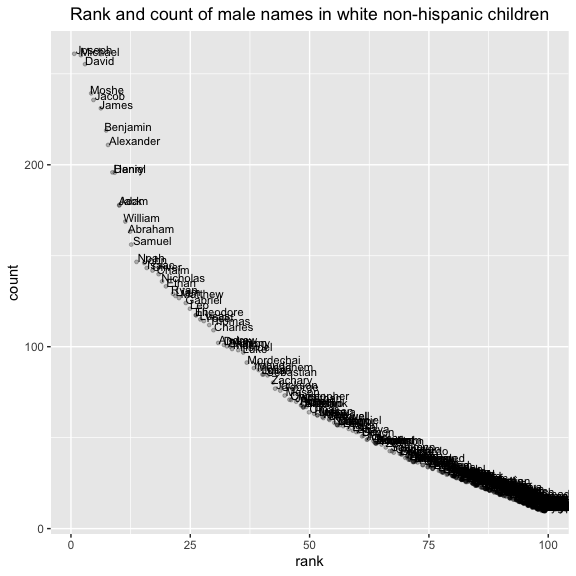

p8105\_hw2\_xj2249
================
jx2249
2019/9/24

# Problem 1

## Read and clean the Mr. Trash Wheel sheet

``` r
library(tidyverse)
library(kableExtra)
mr_trash <- 
        readxl::read_excel("./data/Trash-Wheel-Collection-Totals-8-6-19.xlsx", 
                               sheet = "Mr. Trash Wheel",
                               range = "A2:N406") %>% 
        janitor::clean_names() %>% 
        drop_na(dumpster) %>% 
        mutate(sports_balls = as.integer(sports_balls))
```

## Read and clean precipitation data for 2017 and 2018

``` r
pct_18 <- 
        readxl::read_excel("./data/Trash-Wheel-Collection-Totals-8-6-19.xlsx", 
                             sheet = "2018 Precipitation",
                             range = "A2:B14") %>% 
        janitor::clean_names() %>% 
        drop_na(total) %>% 
        mutate(year = "2018")

pct_17 <- 
        readxl::read_excel("./data/Trash-Wheel-Collection-Totals-8-6-19.xlsx", 
                             sheet = "2017 Precipitation",
                             range = "A2:B14") %>% 
        janitor::clean_names() %>% 
        drop_na(total) %>% 
        mutate(year = "2017")

pct_17_18 <- 
        rbind(pct_18,pct_17) %>% 
        mutate(month = month.name[month])
```

  - In “Mr. Trash Wheel” dataset, there are 344 observations, containing
    information on the dumpter number, date of collection, amount of
    total litter and litter type.

  - It contains information of 344 dumpsters dating from 2014 to 2019.
    The average litter weight and volume are 3.26 tons/year and 15.54
    cubic yards/year.

  - And the median number of sports balls in a dumpster in 2017 is 8.

  - In “precipitation(2017-2018)” dataset, there are 24 observations,
    with 3 variables, showing the total precipitation data for each
    month in 2017 and 2018.

  - The total precipitation in 2017 and 2018 are 32.93 and 70.33
    respectively. Besides, the average precipitation in 2017 and 2018
    are 2.74 and 5.86 respectively.

# Problem 2

## First, clean the data in pols-month.csv

``` r
pols <- 
        read_csv("./data/fivethirtyeight_datasets/pols-month.csv") %>%
        separate(mon,into = c("year","month","day"), sep = "-", convert = TRUE) %>% 
        mutate(month = month.name[month],
               president = ifelse(prez_dem == 1,"dem","gop")) %>%
        select(-c("prez_dem","prez_gop","day"))
```

## Second, clean the data in snp.csv

``` r
snp <- 
        read_csv("./data/fivethirtyeight_datasets/snp.csv") %>%
        separate(date,into = c("month","day","year"), sep = "/", convert = TRUE) %>% 
        select("year","month","close") %>% 
        arrange(year,month) %>% 
        mutate(month = month.name[month])
```

## Third, tidy the unemployment data.

``` r
unemployment <- 
        read_csv("./data/fivethirtyeight_datasets/unemployment.csv") %>%
        janitor::clean_names() %>% 
        pivot_longer("jan":"dec", names_to = "month",values_to = "umemployment_%") %>% 
        mutate(month = month.name[match(month,tolower(month.abb))])
```

## Finally, join the datasets.

``` r
pol_snp <- left_join(pols,snp,by = c("year", "month"))
pol_snp_unemp <- left_join(pol_snp,unemployment,by = c("year", "month"))
```

  - The “pols-month” dataset contains 9 variables concerning whether the
    president was republican or democratic and the number of
    governors,senators and representatives who were democratic or
    republican from Jan 1974 to June 2015.

  - In “snp” dataset, the closing value of the S\&P stock index and its
    associated date are both included.

  - The “unemployment” dataset records the percentage of unemployment in
    each month from 1948 to 2015.

  - The resulting dataset has a **822 x 11 dimension**, namely 822
    obervations and 11 variables. It covers data on some key variables,
    including
    **“president”,“gov\_dem”,“rep\_dem”,“rep\_gop”,“sen\_dem”,“sen\_gop”,“close”
    and “umemployment\_%”** from year of **1947** to **2015**.

# Problem 3

## Load and tidy the data

``` r
baby_name <- 
        read_csv("./data/Popular_Baby_Names.csv") %>% 
        janitor::clean_names() %>% 
        mutate(childs_first_name = str_to_title(childs_first_name),
               ethnicity = str_to_sentence(
                       recode(ethnicity, 
                              "ASIAN AND PACIFIC ISLANDER" = "ASIAN AND PACI",
                              "BLACK NON HISPANIC" = "BLACK NON HISP",
                              "WHITE NON HISPANIC" = "WHITE NON HISP"
                              )
                                           ),
               gender = str_to_title(gender)
               ) %>% 
        distinct(.keep_all = TRUE) %>% 
        view()
```

    ## Parsed with column specification:
    ## cols(
    ##   `Year of Birth` = col_double(),
    ##   Gender = col_character(),
    ##   Ethnicity = col_character(),
    ##   `Child's First Name` = col_character(),
    ##   Count = col_double(),
    ##   Rank = col_double()
    ## )

## Creat table for “Olivia”

``` r
pop_olivia <- 
        baby_name %>% 
        filter(childs_first_name == "Olivia") %>% 
        select("year_of_birth","ethnicity","rank") %>% 
        pivot_wider(names_from = year_of_birth, values_from = rank ) %>% 
        select("ethnicity","2011","2012","2013","2014","2015","2016")

kable(pop_olivia, 
      caption = "Rank in popularity of 'Olivia' as a female baby name over time"
      )
```

<table>

<caption>

Rank in popularity of ‘Olivia’ as a female baby name over time

</caption>

<thead>

<tr>

<th style="text-align:left;">

ethnicity

</th>

<th style="text-align:right;">

2011

</th>

<th style="text-align:right;">

2012

</th>

<th style="text-align:right;">

2013

</th>

<th style="text-align:right;">

2014

</th>

<th style="text-align:right;">

2015

</th>

<th style="text-align:right;">

2016

</th>

</tr>

</thead>

<tbody>

<tr>

<td style="text-align:left;">

Asian and paci

</td>

<td style="text-align:right;">

4

</td>

<td style="text-align:right;">

3

</td>

<td style="text-align:right;">

3

</td>

<td style="text-align:right;">

1

</td>

<td style="text-align:right;">

1

</td>

<td style="text-align:right;">

1

</td>

</tr>

<tr>

<td style="text-align:left;">

Black non hisp

</td>

<td style="text-align:right;">

10

</td>

<td style="text-align:right;">

8

</td>

<td style="text-align:right;">

6

</td>

<td style="text-align:right;">

8

</td>

<td style="text-align:right;">

4

</td>

<td style="text-align:right;">

8

</td>

</tr>

<tr>

<td style="text-align:left;">

Hispanic

</td>

<td style="text-align:right;">

18

</td>

<td style="text-align:right;">

22

</td>

<td style="text-align:right;">

22

</td>

<td style="text-align:right;">

16

</td>

<td style="text-align:right;">

16

</td>

<td style="text-align:right;">

13

</td>

</tr>

<tr>

<td style="text-align:left;">

White non hisp

</td>

<td style="text-align:right;">

2

</td>

<td style="text-align:right;">

4

</td>

<td style="text-align:right;">

1

</td>

<td style="text-align:right;">

1

</td>

<td style="text-align:right;">

1

</td>

<td style="text-align:right;">

1

</td>

</tr>

</tbody>

</table>

## The most popular name among male children over time.

``` r
pop_male_name <- 
        baby_name %>% 
        filter(gender == "Male" & rank == 1) %>% 
        select(year_of_birth, ethnicity, childs_first_name) %>% 
        pivot_wider(names_from = year_of_birth, values_from = childs_first_name ) %>% 
        select("ethnicity","2011","2012","2013","2014","2015","2016") 
kable(pop_male_name,
      caption = "The most popular name among male children over time")
```

<table>

<caption>

The most popular name among male children over time

</caption>

<thead>

<tr>

<th style="text-align:left;">

ethnicity

</th>

<th style="text-align:left;">

2011

</th>

<th style="text-align:left;">

2012

</th>

<th style="text-align:left;">

2013

</th>

<th style="text-align:left;">

2014

</th>

<th style="text-align:left;">

2015

</th>

<th style="text-align:left;">

2016

</th>

</tr>

</thead>

<tbody>

<tr>

<td style="text-align:left;">

Asian and paci

</td>

<td style="text-align:left;">

Ethan

</td>

<td style="text-align:left;">

Ryan

</td>

<td style="text-align:left;">

Jayden

</td>

<td style="text-align:left;">

Jayden

</td>

<td style="text-align:left;">

Jayden

</td>

<td style="text-align:left;">

Ethan

</td>

</tr>

<tr>

<td style="text-align:left;">

Black non hisp

</td>

<td style="text-align:left;">

Jayden

</td>

<td style="text-align:left;">

Jayden

</td>

<td style="text-align:left;">

Ethan

</td>

<td style="text-align:left;">

Ethan

</td>

<td style="text-align:left;">

Noah

</td>

<td style="text-align:left;">

Noah

</td>

</tr>

<tr>

<td style="text-align:left;">

Hispanic

</td>

<td style="text-align:left;">

Jayden

</td>

<td style="text-align:left;">

Jayden

</td>

<td style="text-align:left;">

Jayden

</td>

<td style="text-align:left;">

Liam

</td>

<td style="text-align:left;">

Liam

</td>

<td style="text-align:left;">

Liam

</td>

</tr>

<tr>

<td style="text-align:left;">

White non
hisp

</td>

<td style="text-align:left;">

Michael

</td>

<td style="text-align:left;">

Joseph

</td>

<td style="text-align:left;">

David

</td>

<td style="text-align:left;">

Joseph

</td>

<td style="text-align:left;">

David

</td>

<td style="text-align:left;">

Joseph

</td>

</tr>

</tbody>

</table>

## Scatter plot–rank and count of male names in white non-hispanic children

``` r
baby_name %>%
        filter(gender == "Male" & year_of_birth == 2016 & ethnicity == "White non hisp") %>% 
        ggplot(aes(x = rank, y = count)) + 
        geom_point(position = "jitter",alpha = 0.25, size = 1) +
        geom_text(aes(label = childs_first_name),hjust = 0, vjust = 0,size = 3) +
        labs(title = "Rank and count of male names in white non-hispanic children") +
        theme(plot.title = element_text(hjust = 0.5))
```

<!-- -->
