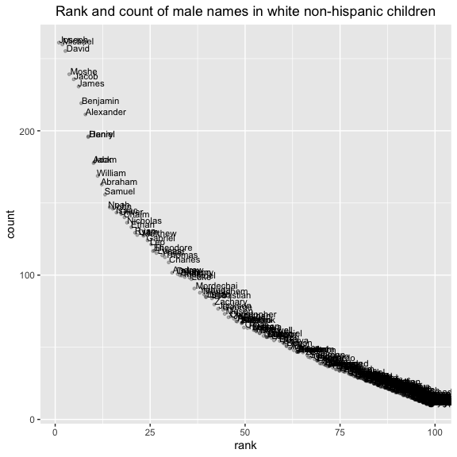

p8105\_hw2\_xj2249
================
jx2249
2019/9/24

# Problem 1

## Read and clean the Mr. Trash Wheel sheet

``` r
library(tidyverse)
mr_trash <- 
        readxl::read_excel("./data/HealthyHarborWaterWheelTotals2018-7-28.xlsx", 
                               sheet = "Mr. Trash Wheel",
                               range = "A2:N336") %>% 
        janitor::clean_names() %>% 
        drop_na(dumpster) %>% 
        mutate(sports_balls = as.integer(sports_balls))
```

## Read and clean precipitation data for 2017 and 2018

``` r
pct_18 <- 
        readxl::read_excel("./data/HealthyHarborWaterWheelTotals2018-7-28.xlsx", 
                             sheet = "2018 Precipitation",
                             range = "A2:B14") %>% 
        janitor::clean_names() %>% 
        drop_na(total) %>% 
        mutate(year = "2018")

pct_17 <- 
        readxl::read_excel("./data/HealthyHarborWaterWheelTotals2018-7-28.xlsx", 
                             sheet = "2017 Precipitation",
                             range = "A2:B14") %>% 
        janitor::clean_names() %>% 
        drop_na(total) %>% 
        mutate(year = "2017")

pct_17_18 <- 
        rbind(pct_18,pct_17) %>% 
        mutate(month = month.name[month])
```

Write a paragraph about these data; you are encouraged to use inline R.

Be sure to note the number of observations in both resulting datasets,
and give examples of key variables.

What was the median number of sports balls in a dumpster in 2017? done

The median number of sports balls in a dumpster in 2017 is 8

## Mr. Trash Wheel dataset

In Mr. Trash Wheel dataset, there are ‘285’ observations.

In precipitation(2017-2018) dataset, there are 19 observations, with 3
variables, indicating the total precipitation data for 19 months in 2017
and 2018. The total precipitation in 2017 and 2018 are 32.93 and 23.5
respectively. Besides, the average precipitation in 2017 and 2018 are
2.74 and 3.36 respectively.

# Problem 2

## First, clean the data in pols-month.csv

``` r
pols <- 
        read_csv("./data/fivethirtyeight_datasets/pols-month.csv") %>%
        separate(mon,into = c("year","month","day"), sep = "-", convert = TRUE) %>% 
        mutate(month = month.name[month],
               president = ifelse(prez_dem == 1,"dem","gop")) %>%
        select(-c("prez_dem","prez_gop","day"))
```

## Second, clean the data in snp.csv

``` r
snp <- 
        read_csv("./data/fivethirtyeight_datasets/snp.csv") %>%
        separate(date,into = c("month","day","year"), sep = "/", convert = TRUE) %>% 
        select("year","month","close") %>% 
        arrange(year,month) %>% 
        mutate(month = month.name[month])
```

## Third, tidy the unemployment data

This process will involve switching from ???wide??? to ???long???
format; ensuring that key variables have the same name; and ensuring
that key variables take the same values.

``` r
unemployment <- 
        read_csv("./data/fivethirtyeight_datasets/unemployment.csv") %>%
        janitor::clean_names() %>% 
        pivot_longer("jan":"dec", names_to = "month",values_to = "umemployment_%") %>% 
        mutate(month = month.name[match(month,tolower(month.abb))])
```

## Join the datasets by merging snp into pols, and merging unemployment into the result.

``` r
pol_snp <- left_join(pols,snp,by = c("year", "month"))
pol_snp_unemp <- left_join(pol_snp,unemployment,by = c("year", "month"))
```

Write a short paragraph about these datasets. Explain briefly what each
dataset contained, and describe the resulting dataset (e.g. give the
dimension, range of years, and names of key variables).

# Problem 3

## Load and tidy the data

``` r
baby_name <- 
        read_csv("./data/Popular_Baby_Names.csv") %>% 
        janitor::clean_names() %>% 
        mutate(childs_first_name = str_to_title(childs_first_name),
               ethnicity = str_to_sentence(recode(ethnicity, "ASIAN AND PACIFIC ISLANDER" = "ASIAN AND PACI",
                                                                "BLACK NON HISPANIC" = "BLACK NON HISP",
                                                                        "WHITE NON HISPANIC" = "WHITE NON HISP")),
               gender = str_to_title(gender)
               ) %>% 
        distinct(.keep_all = TRUE) %>% 
        view()
```

    ## Parsed with column specification:
    ## cols(
    ##   `Year of Birth` = col_double(),
    ##   Gender = col_character(),
    ##   Ethnicity = col_character(),
    ##   `Child's First Name` = col_character(),
    ##   Count = col_double(),
    ##   Rank = col_double()
    ## )

## Creat table for ““Olivia”

``` r
pop_olivia <- 
        baby_name %>% 
        filter(childs_first_name == "Olivia") %>% 
        select("year_of_birth","ethnicity","rank") %>% 
        pivot_wider(names_from = year_of_birth, values_from = rank ) %>% 
        select("ethnicity","2011","2012","2013","2014","2015","2016")
knitr::kable(pop_olivia) 
```

| ethnicity      | 2011 | 2012 | 2013 | 2014 | 2015 | 2016 |
| :------------- | ---: | ---: | ---: | ---: | ---: | ---: |
| Asian and paci |    4 |    3 |    3 |    1 |    1 |    1 |
| Black non hisp |   10 |    8 |    6 |    8 |    4 |    8 |
| Hispanic       |   18 |   22 |   22 |   16 |   16 |   13 |
| White non hisp |    2 |    4 |    1 |    1 |    1 |    1 |

``` r
# Finally, for male, white non-hispanic children born in 2016, produce a scatter plot showing the number of children with a name (y axis) against the rank in popularity of that name (x axis).
```

Finally, for male, white non-hispanic children born in 2016, produce a
scatter plot showing the number of children with a name (y axis) against
the rank in popularity of that name (x axis).

## The most popular name among male children over time.

``` r
pop_male_name <- 
        baby_name %>% 
        filter(gender == "Male" & rank == 1) %>% 
        select(year_of_birth, ethnicity, childs_first_name) %>% 
        pivot_wider(names_from = year_of_birth, values_from = childs_first_name ) %>% 
        select("ethnicity","2011","2012","2013","2014","2015","2016") 
knitr::kable(pop_male_name) 
```

| ethnicity      | 2011    | 2012   | 2013   | 2014   | 2015   | 2016   |
| :------------- | :------ | :----- | :----- | :----- | :----- | :----- |
| Asian and paci | Ethan   | Ryan   | Jayden | Jayden | Jayden | Ethan  |
| Black non hisp | Jayden  | Jayden | Ethan  | Ethan  | Noah   | Noah   |
| Hispanic       | Jayden  | Jayden | Jayden | Liam   | Liam   | Liam   |
| White non hisp | Michael | Joseph | David  | Joseph | David  | Joseph |

## A scatter plot

``` r
baby_name %>%
        filter(gender == "Male" & year_of_birth == 2016 & ethnicity == "White non hisp") %>% 
        ggplot(aes(x = rank, y = count)) + 
        geom_point(position = "jitter",alpha = 0.25, size = 1) +
        geom_text(aes(label = childs_first_name),hjust = 0, vjust = 0,size = 3) +
        labs(title = "Rank and count of male names in white non-hispanic children") +
        theme(plot.title = element_text(hjust = 0.5))
```

<!-- -->
